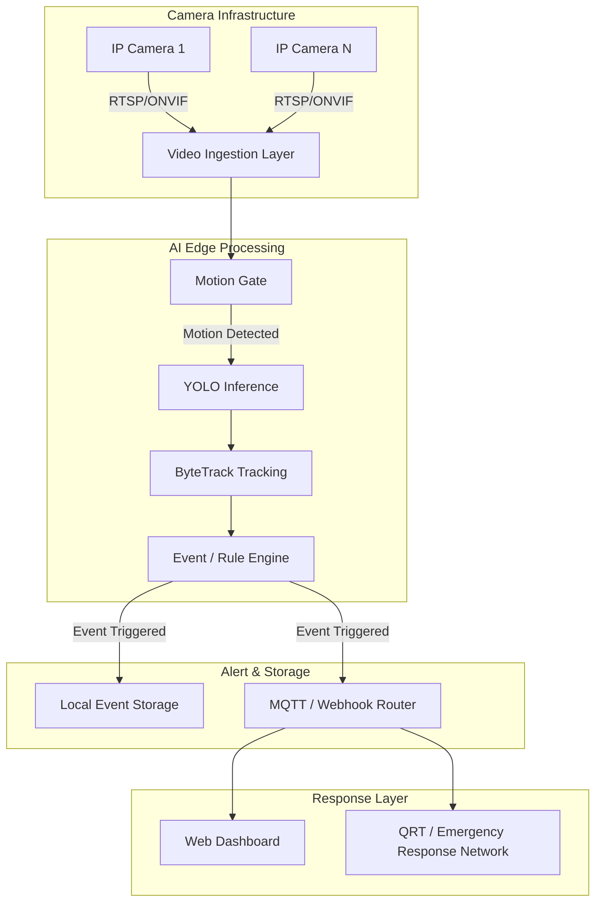

# SecurePulse

### Intelligent Emergency Response & Surveillance Network

> **Real-time AI surveillance, intelligent threat detection, and rapid emergency alerting.**

---

## Overview

**SecurePulse** is an intelligent CCTV surveillance network designed to analyze real-time video streams for meaningful security events. By leveraging edge AI object detection and multi-object tracking, SecurePulse turns passive camera feeds into proactive alerting systems. 

The system focuses on detecting intrusions, restricted-zone breaches, and loitering, enabling real-time alert generation and emergency response support. By emphasizing edge/GPU-based processing, SecurePulse offers a cost-effective deployment model that operates locally, significantly reducing the reliance on cloud infrastructure.

*(Note: SecurePulse is currently in active development. Edge perception infrastructure and the FastAPI backend event engine are implemented.)*

---

## Problem Statement

Traditional CCTV systems primarily record video footage but lack the intelligence to understand or analyze the events they capture. This leaves security personnel reacting to incidents after they happen rather than proactively intervening.

As defined in the project concept, the limitations of current solutions include:
* **Cloud-based AI Costs:** Continuous cloud video processing introduces unsustainable recurring bandwidth and compute costs.
* **Privacy Concerns:** Sending sensitive surveillance footage to external cloud servers raises significant privacy risks.
* **Expensive Proprietary Hardware:** Many intelligent surveillance systems require costly, locked-in hardware appliances.
* **Vendor Lock-in:** Proprietary systems prevent flexible integration with existing camera infrastructure or emergency response networks.

SecurePulse addresses this gap by providing an open, locally deployable intelligence layer over existing RTSP/ONVIF cameras.

---

## Key Features

* 🎥 Real-time CCTV analysis (RTSP ingestion via Frigate) **(Implemented)**
* 🤖 Edge AI object detection (Person & Vehicle) **(Implemented)**
* 🚶 Person detection **(Implemented)**
* 🚗 Vehicle detection **(Implemented)**
* ⚡ Motion-gated inference **(Implemented)**
* 🔔 MQTT event ingestion & normalization **(Implemented)**
* 💾 Event evidence metadata & persistence (PostgreSQL / asyncpg) **(Implemented)**
* 📡 Real-time WebSocket event streaming **(Implemented)**
* 🔐 JWT authentication & scope-based RBAC **(Implemented)**
* 📹 Camera management & multi-camera mapping **(Implemented)**
* 🧠 Security engine integration adapter with fallback **(Implemented)**
* 🚨 Intrusion detection & zone breach evaluation **(In Progress)**
* 📍 Restricted-zone detection **(In Progress)**
* 🖥️ Web dashboard (React + Vite) **(In Progress / Scaffolded)**
* ⏱️ Loitering detection **(Planned)**
* 📏 Line-crossing detection **(Planned)**
* 👮 QRT alert/deployment emergency workflow **(Planned)**

---

## How SecurePulse Works

SecurePulse is designed around a modular processing pipeline that minimizes unnecessary computation while ensuring accurate threat detection:

```text
CCTV Camera
     ↓
RTSP / ONVIF Stream
     ↓
Video Ingestion
     ↓
Motion Detection / Motion Gate
     ↓
YOLO Object Detection
     ↓
ByteTrack Object Tracking
     ↓
Event / Rule Engine
     ↓
Threat / Event Identification
     ↓
Alert Routing
     ↓
Dashboard + Emergency Response
     ↓
Event Clip Storage
```

1. **Video Ingestion:** Connects to standard IP cameras via RTSP or ONVIF.
2. **Motion Gate:** A lightweight motion detection filter drops frames without movement to save heavy AI processing.
3. **Detection & Tracking:** YOLO identifies objects (e.g., persons, vehicles) in the frame, and ByteTrack assigns persistent IDs to them.
4. **Rule Engine:** Tracks are evaluated against configured rules (like restricted zones or tripwires).
5. **Alerting & Storage:** When an event is triggered, an alert is dispatched, and a short video clip of the event is saved locally.

---

## System Architecture



---

## Detection & Event Intelligence

SecurePulse aims to identify meaningful security events using the following intelligence layers:

### Object Detection
YOLO-based detection of relevant objects, specifically focusing on people and vehicles, ignoring irrelevant background elements.

### Object Tracking
ByteTrack maintains persistent IDs across sequential frames, allowing the system to track movement trajectories over time.

### Intrusion Detection
Restricted zones (polygons drawn over the camera view) trigger immediate alerts when tracked objects enter them.

### Line Crossing
Virtual boundaries can be configured to detect directional crossing events (e.g., jumping a fence).

### Loitering
Objects remaining in a defined zone beyond a specific time threshold generate a loitering event.

### Motion-Gated Inference
A pre-processing step that uses basic motion filtering to avoid unnecessary AI inference when there is no meaningful movement in the frame, saving compute resources.

---

## Emergency Response & QRT

The intended emergency response workflow for SecurePulse bridges the gap between digital detection and physical security response:

```text
Threat Detected
      ↓
Event Classified
      ↓
Alert Generated
      ↓
Alert Routed
      ↓
Security / QRT Notified
      ↓
Rapid Response
```

**Implementation Status:**
* **Implemented:** None. (The repository is currently empty).
* **Planned:** QRT deployment/response functionality, alert routing, and physical responder notification systems are described in the project concept but not yet implemented. SecurePulse does not currently dispatch physical QRT personnel.

---

## Deployment Modes

SecurePulse is designed to scale from small embedded devices to large centralized GPU servers:

| Mode | Hardware | Camera Capacity | Purpose |
| :--- | :--- | :--- | :--- |
| **Edge-only** | Raspberry Pi 5 + Hailo-8L / Coral USB | 2–4 streams/unit | Small deployments |
| **GPU-centralized** | RTX 3060 12GB + DeepStream | 16–32 streams | Multi-camera deployments |
| **Hybrid** | Edge filtering + GPU | Variable | Scalable deployment |

---

## Technology Stack

### Edge Perception & Video Ingestion
* **Frigate NVR** (v0.13.2) — Hardware-accelerated object detection (OpenVINO / Coral TPU / CPU)
* **MediaMTX** — RTSP/WebRTC stream simulator & relay
* **RTSP / ONVIF** — IP camera protocol support

### Messaging & Real-Time
* **Eclipse Mosquitto** — MQTT broker for edge event telemetry
* **WebSockets** — Process-local real-time event streaming (`/api/v1/events/stream`)

### Backend Application
* **FastAPI** — High-performance asynchronous REST & WebSocket framework
* **SQLAlchemy 2.x & asyncpg** — Asynchronous PostgreSQL ORM & driver
* **Alembic** — Database schema migrations
* **Pydantic v2** — Data validation, settings management, and domain modeling
* **Pytest & HTTPX** — Automated unit and integration testing

### Frontend (Dashboard)
* **React & Vite** — Next-generation frontend web dashboard (scaffolded in `dashboard/`)
* **Tailwind CSS** — Utility-first styling

### Storage & Persistence
* **PostgreSQL / Cloud SQL** — Camera registry, security event records, evidence metadata
* **Local Disk / NAS** — Event-based video clips and snapshot storage via Frigate mount

---

## Project Architecture / Folder Structure

```text
SecurePulse/
├── backend/                    # FastAPI backend & event processing engine
│   ├── alembic/                # Database migrations (PostgreSQL)
│   ├── app/
│   │   ├── api/                # REST & WebSocket endpoints
│   │   ├── core/               # App configuration, auth, logging
│   │   ├── database/           # Async SQLAlchemy engine & session factory
│   │   ├── domain/             # Pydantic schemas & business logic models
│   │   ├── integrations/       # Frigate NVR & Security Engine HTTP adapters
│   │   ├── models/             # SQLAlchemy ORM models (Camera, SecurityEvent, Evidence)
│   │   ├── realtime/           # In-process WebSocket event publisher
│   │   ├── repositories/       # Data access repositories
│   │   ├── schemas/            # Request/response validation schemas
│   │   ├── services/           # Event processing & camera services
│   │   ├── workers/            # Frigate MQTT event listener background worker
│   │   └── main.py             # Application entrypoint
│   ├── tests/                  # Pytest test suite (unit & integration)
│   ├── alembic.ini
│   ├── requirements.txt
│   └── README.md
├── dashboard/                  # Frontend web dashboard (React + Vite, scaffolded)
├── deployment/                 # Orchestration & infrastructure
│   ├── mosquitto/              # Eclipse Mosquitto MQTT configuration
│   ├── docker-compose.yml      # Containerized stack (Frigate, Mosquitto, MediaMTX)
│   └── .env.example            # Deployment environment variables
├── docs/                       # Architecture & setup guides
│   ├── phase1_setup.md         # Phase 1 perception infrastructure setup guide
│   └── database_contract.md    # Database models & access contract
├── frigate/                    # Frigate NVR configuration & media
│   ├── config/frigate.yml
│   └── media/
├── tests/                      # System & end-to-end integration tests
│   └── test_mqtt_subscriber.py # Standalone MQTT subscriber verification
├── .env.example                # Central environment variables template
├── .gitignore                  # Monorepo git ignore rules
└── README.md
```

---

## Installation & Setup

### Prerequisites
* **Docker Engine** (v20.10+) & **Docker Compose** (v2.0+)
* **Python 3.10+**

### Step 1: Start Edge Infrastructure

Launch Frigate NVR, Eclipse Mosquitto MQTT Broker, and the MediaMTX RTSP stream simulator:

```bash
cd deployment
cp .env.example .env
docker compose up -d
```

- **Frigate Web UI**: `http://localhost:5000`
- **MQTT Broker**: `localhost:1883`
- **MediaMTX RTSP**: `rtsp://localhost:8554/live`

### Step 2: Launch Backend Application

In a new terminal:

```bash
cd backend
python -m venv .venv
source .venv/bin/activate    # On Windows: .\.venv\Scripts\Activate.ps1
pip install -r requirements.txt
cp .env.example .env

# Apply database migrations
alembic upgrade head

# Start FastAPI server
uvicorn app.main:app --reload
```

- **Liveness & Readiness**: `http://localhost:8000/health`
- **REST API Docs**: `http://localhost:8000/docs`
- **WebSocket Event Stream**: `ws://localhost:8000/api/v1/events/stream`

### Step 3: Run Tests

```bash
cd backend
pytest -v
```

---

## Current Status

> **Status: Active Development**

**Implemented**
* ✅ Edge Perception Stack (Frigate NVR, MediaMTX RTSP simulator, Mosquitto MQTT)
* ✅ Resilient Frigate MQTT event listener worker with exponential backoff
* ✅ Deduplication & event normalization pipeline
* ✅ Asynchronous PostgreSQL persistence layer (SQLAlchemy 2.x, asyncpg, Alembic)
* ✅ Security Engine integration adapter with configurable fallback (`STORE_UNCLASSIFIED` / `REJECT`)
* ✅ REST API (`/api/v1/cameras`, `/api/v1/events` with pagination, filtering, date range)
* ✅ Real-time WebSocket event streaming (`/api/v1/events/stream`)
* ✅ JWT Bearer token authentication & scope-based RBAC
* ✅ Test suite covering API, auth, database, event processor, frigate adapter, health, and realtime publisher

**In Progress**
* 🔄 Zone breach & intrusion rule evaluations
* 🔄 React + Vite web dashboard UI (`dashboard/`)

**Planned**
* 📋 QRT emergency dispatch workflow
* 📋 Line-crossing & loitering analytics
* 📋 Multi-camera cross-tracking (v2)

---

## Roadmap

* [x] Single-camera RTSP ingestion pipeline
* [x] Frigate object detection (person & vehicle)
* [x] MQTT event ingestion & normalization
* [x] Asynchronous PostgreSQL storage & migrations
* [x] REST API for camera and event querying
* [x] Real-time WebSocket event broadcast
* [x] JWT authentication & scope authorization
* [ ] Zone-based intrusion rules
* [ ] Loitering & line-crossing detection
* [ ] React web dashboard
* [ ] QRT alert/deployment emergency workflow
* [ ] Multi-camera GPU pipeline & cross-re-identification

---

## Limitations

As defined in the PRD, the system acknowledges the following limitations:
* Low-light/night detection challenges (Standard cameras).
* Possible requirement for IR camera input for reliable 24/7 operation.
* Potential need for model fine-tuning for specific operational environments.
* Cross-camera re-identification is deferred to v2.
* Privacy/legal considerations for real-world deployment.

---

## Future Scope

* Improved night-time detection
* Multi-camera re-identification
* Advanced threat classification
* QRT workflow integration
* More efficient edge inference
* Larger-scale deployment
* Better alert prioritization

---

## Demo / Screenshots

> Screenshots and demonstration footage will be added as the prototype evolves.

---

## Project Vision

> **Detect earlier. Alert faster. Respond smarter.**

SecurePulse aims to transform conventional passive CCTV infrastructure into an active, intelligent surveillance and emergency-response network, bridging the critical gap between threat detection and rapid intervention.
