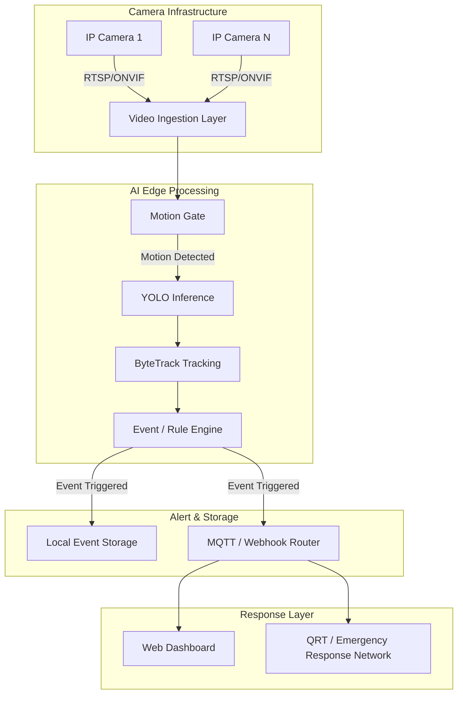

# SecurePulse

### Intelligent Emergency Response & Surveillance Network

> **Real-time AI surveillance, intelligent threat detection, and rapid emergency alerting.**

---

## Overview

**SecurePulse** is an intelligent CCTV surveillance network designed to analyze real-time video streams for meaningful security events. By leveraging edge AI object detection and multi-object tracking, SecurePulse turns passive camera feeds into proactive alerting systems. 

The system focuses on detecting intrusions, restricted-zone breaches, and loitering, enabling real-time alert generation and emergency response support. By emphasizing edge/GPU-based processing, SecurePulse offers a cost-effective deployment model that operates locally, significantly reducing the reliance on cloud infrastructure.

*(Note: SecurePulse is currently in the early prototype phase. The features described reflect the intended architecture and are not yet production-ready.)*

---

## Problem Statement

Traditional CCTV systems primarily record video footage but lack the intelligence to understand or analyze the events they capture. This leaves security personnel reacting to incidents after they happen rather than proactively intervening.

As defined in the project concept, the limitations of current solutions include:
* **Cloud-based AI Costs:** Continuous cloud video processing introduces unsustainable recurring bandwidth and compute costs.
* **Privacy Concerns:** Sending sensitive surveillance footage to external cloud servers raises significant privacy risks.
* **Expensive Proprietary Hardware:** Many intelligent surveillance systems require costly, locked-in hardware appliances.
* **Vendor Lock-in:** Proprietary systems prevent flexible integration with existing camera infrastructure or emergency response networks.

SecurePulse addresses this gap by providing an open, locally deployable intelligence layer over existing RTSP/ONVIF cameras.

---

## Key Features

*The features below represent the planned capabilities for SecurePulse. As the repository is currently empty, these are marked as planned.*

* 🎥 Real-time CCTV analysis **(Planned)**
* 🤖 AI object detection **(Planned)**
* 🚶 Person detection **(Planned)**
* 🚗 Vehicle detection **(Planned)**
* 🚨 Intrusion detection **(Planned)**
* 📍 Restricted-zone detection **(Planned)**
* 📏 Line-crossing detection **(Planned)**
* ⏱️ Loitering detection **(Planned)**
* 🎯 Multi-object tracking using ByteTrack **(Planned)**
* ⚡ Motion-gated inference **(Planned)**
* 🔔 MQTT/Webhook alerting **(Planned)**
* 💾 Event-based video recording **(Planned)**
* 🖥️ Web dashboard **(Planned)**
* 📹 Multi-camera support **(Planned)**
* 🖥️ Edge/GPU deployment **(Planned)**
* 👮 QRT alert/deployment workflow **(Planned)**

---

## How SecurePulse Works

SecurePulse is designed around a modular processing pipeline that minimizes unnecessary computation while ensuring accurate threat detection:

```text
CCTV Camera
     ↓
RTSP / ONVIF Stream
     ↓
Video Ingestion
     ↓
Motion Detection / Motion Gate
     ↓
YOLO Object Detection
     ↓
ByteTrack Object Tracking
     ↓
Event / Rule Engine
     ↓
Threat / Event Identification
     ↓
Alert Routing
     ↓
Dashboard + Emergency Response
     ↓
Event Clip Storage
```

1. **Video Ingestion:** Connects to standard IP cameras via RTSP or ONVIF.
2. **Motion Gate:** A lightweight motion detection filter drops frames without movement to save heavy AI processing.
3. **Detection & Tracking:** YOLO identifies objects (e.g., persons, vehicles) in the frame, and ByteTrack assigns persistent IDs to them.
4. **Rule Engine:** Tracks are evaluated against configured rules (like restricted zones or tripwires).
5. **Alerting & Storage:** When an event is triggered, an alert is dispatched, and a short video clip of the event is saved locally.

---

## System Architecture



---

## Detection & Event Intelligence

SecurePulse aims to identify meaningful security events using the following intelligence layers:

### Object Detection
YOLO-based detection of relevant objects, specifically focusing on people and vehicles, ignoring irrelevant background elements.

### Object Tracking
ByteTrack maintains persistent IDs across sequential frames, allowing the system to track movement trajectories over time.

### Intrusion Detection
Restricted zones (polygons drawn over the camera view) trigger immediate alerts when tracked objects enter them.

### Line Crossing
Virtual boundaries can be configured to detect directional crossing events (e.g., jumping a fence).

### Loitering
Objects remaining in a defined zone beyond a specific time threshold generate a loitering event.

### Motion-Gated Inference
A pre-processing step that uses basic motion filtering to avoid unnecessary AI inference when there is no meaningful movement in the frame, saving compute resources.

---

## Emergency Response & QRT

The intended emergency response workflow for SecurePulse bridges the gap between digital detection and physical security response:

```text
Threat Detected
      ↓
Event Classified
      ↓
Alert Generated
      ↓
Alert Routed
      ↓
Security / QRT Notified
      ↓
Rapid Response
```

**Implementation Status:**
* **Implemented:** None. (The repository is currently empty).
* **Planned:** QRT deployment/response functionality, alert routing, and physical responder notification systems are described in the project concept but not yet implemented. SecurePulse does not currently dispatch physical QRT personnel.

---

## Deployment Modes

SecurePulse is designed to scale from small embedded devices to large centralized GPU servers:

| Mode | Hardware | Camera Capacity | Purpose |
| :--- | :--- | :--- | :--- |
| **Edge-only** | Raspberry Pi 5 + Hailo-8L / Coral USB | 2–4 streams/unit | Small deployments |
| **GPU-centralized** | RTX 3060 12GB + DeepStream | 16–32 streams | Multi-camera deployments |
| **Hybrid** | Edge filtering + GPU | Variable | Scalable deployment |

---

## Technology Stack

The following technologies are planned for the implementation of SecurePulse:

### AI / ML
* YOLOv8
* ByteTrack
* TensorRT
* TFLite INT8

### Video Processing
* NVIDIA DeepStream
* Frigate NVR
* RTSP
* ONVIF

### Frontend
* React
* Vite
* Tailwind CSS

### Communication
* MQTT
* Webhooks

### Backend / Configuration
* Firebase

### Storage
* Local Disk / NAS
* Event-based video clips

---

## Project Architecture / Folder Structure

Currently, the repository is empty pending the initial code commit.

```text
SecurePulse/
└── README.md
```

**Suggested Future Structure:**
```text
SecurePulse/
├── backend/          # Inference pipeline and event engine
├── frontend/         # React/Vite dashboard
├── config/           # System configuration files
├── docker/           # Deployment containers
└── README.md
```

---

## Installation & Setup

> Setup instructions will be added as the implementation is finalized.

---

## Usage

There are currently no usage instructions as the code implementation has not yet begun.

---

## Configuration

Configuration documentation will be added once the system is implemented. Future configurations are expected to include camera streams, detection thresholds, restricted zones, alert destinations, and storage retention.

---

## Performance Targets

The following are the intended performance targets for the SecurePulse prototype:

| Metric | Prototype Target |
| :--- | :--- |
| Detection Precision | ≥85% |
| False Alert Rate | <10% |
| GPU Alert Latency | <1 second |
| Edge Alert Latency | <2 seconds |
| Minimum Input | 720p |
| Default Retention | 7 days |

> **Note:** These are prototype target metrics defined in the PRD, not experimentally validated results unless benchmark evidence is available in the repository.

---

## Privacy & Security

SecurePulse prioritizes privacy through design:
* **Local Processing:** All video streams are processed at the edge or on local networks.
* **No Mandatory Cloud Dependency:** No video feeds are required to be sent to external cloud servers for AI processing.
* **Local Event Storage:** Video clips are kept securely on local storage or NAS.
* **Configurable Retention:** Automated deletion of old events ensures data minimization.
* **No Facial Identity Matching:** The v1 prototype focuses on object detection, not facial recognition or identity tracking.

*(Legal and privacy requirements must be evaluated based on jurisdiction before real-world deployment.)*

---

## Current Status

> **Status: Prototype Phase**

The repository is currently being initialized. No codebase has been established yet.

**Implemented**
* None

**In Progress**
* None

**Planned**
* Core video processing pipeline
* YOLO & ByteTrack integration
* Frontend dashboard

---

## Roadmap

* [ ] Single-camera pipeline
* [ ] YOLO detection
* [ ] ByteTrack tracking
* [ ] Zone-based rules
* [ ] Line-crossing detection
* [ ] Loitering detection
* [ ] MQTT/Webhook alerting
* [ ] Web dashboard
* [ ] Event storage
* [ ] Multi-camera GPU pipeline
* [ ] QRT alert/deployment integration
* [ ] Further optimization

---

## Limitations

As defined in the PRD, the system acknowledges the following limitations:
* Low-light/night detection challenges (Standard cameras).
* Possible requirement for IR camera input for reliable 24/7 operation.
* Potential need for model fine-tuning for specific operational environments.
* Cross-camera re-identification is deferred to v2.
* Privacy/legal considerations for real-world deployment.

---

## Future Scope

* Improved night-time detection
* Multi-camera re-identification
* Advanced threat classification
* QRT workflow integration
* More efficient edge inference
* Larger-scale deployment
* Better alert prioritization

---

## Demo / Screenshots

> Screenshots and demonstration footage will be added as the prototype evolves.

---

## Project Vision

> **Detect earlier. Alert faster. Respond smarter.**

SecurePulse aims to transform conventional passive CCTV infrastructure into an active, intelligent surveillance and emergency-response network, bridging the critical gap between threat detection and rapid intervention.
